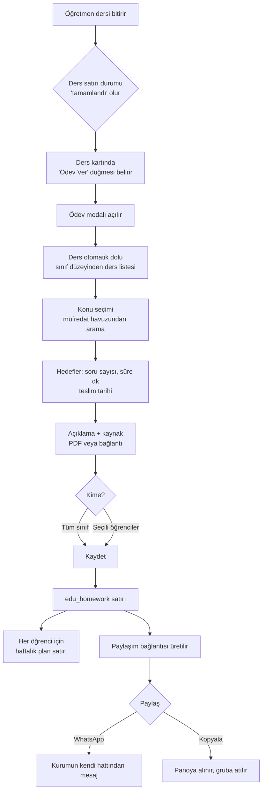
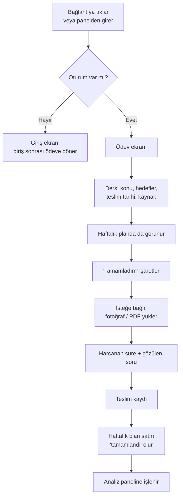
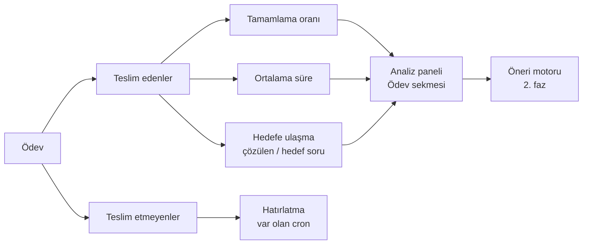

# Ödev Verme ve Takip Modülü — Ürün ve Teknik Plan

Hazırlanma tarihi: 24 Eylül 2026
Kapsam: Türkçe Uzmanı ve platform dışı diğer kurumlar. Online VIP Dershane (platform kurumu) ve Ders & Koçluk akışlarında kapalı.

---

## 0. Önce şunu bilin: altyapının yarısı zaten var

Sıfırdan bir modül kurmuyoruz. Sistemde şu anda çalışan parçalar:

| Var olan | Ne yapıyor | Nerede |
|---|---|---|
| `edu_lesson_rows` | Öğretmenin ders satırı — kurum, sınıf, ders adı, tarih | Supabase |
| `edu_homework` | Ödev kaydı — başlık, kitap, soru aralığı, açıklama, teslim tarihi, atama modu (sınıf / seçili öğrenciler), PDF eki, hatırlatma damgaları | Supabase |
| `edu_homework_submissions` | Öğrenci teslimi — fotoğraf, video, PDF, öğretmen notu, not, durum | Supabase |
| `/api/edu-panel` | `homework`, `submissions`, `submit`, `homework-stats`, `homework-pdf-upload` işlemleri | `handlers/edu-panel.js` |
| Öğretmen / öğrenci ödev ekranı | Ödev oluşturma ve teslim | `pages/eduPanel/*` |
| Hatırlatma cron'ları | 24 saat kala, teslim günü, geciken ödev bildirimi | `handlers/cron-edu-homework-*.js` |
| `weekly_planner_entries` | Öğrencinin haftalık planı — ders, başlık, hedef adet, yapılan adet, tarih, saat, durum, kurum | Supabase |

**Eksik olan, sizin istediğiniz 7 şey:**

1. Ders bitince görünen tek tıklık **"Ödev Ver"** girişi (şu an ödev ayrı ekrandan veriliyor)
2. **Müfredat konu seçimi** (şu an serbest metin; konu havuzu bağlı değil)
3. **Soru sayısı hedefi + süre hedefi** alanları
4. **Haftalık plana otomatik düşme**
5. **Analiz panelinde "Ödev" kategorisi**
6. **Paylaşım bağlantısı + WhatsApp'a gönderme**
7. **Kurum bazlı açma/kapama** (bu modül yalnız platform dışı kurumlarda)

Bu plan yalnız bu yedi eksiği kapatır. Var olan ödev kayıtlarına, tablolara ve cron'lara dokunulmaz; tüm veritabanı değişiklikleri sütun ekleme biçimindedir.

---

## 1. UX akış diyagramı

### 1.1 Öğretmen akışı



### 1.2 Öğrenci akışı



### 1.3 Takip akışı



---

## 2. Veritabanı şeması

### 2.1 `edu_homework` — yeni sütunlar (geriye uyumlu, hepsi NULL kabul eder)

| Sütun | Tip | Açıklama |
|---|---|---|
| `institution_id` | `text` | Kurum. Mevcut satırlar `edu_lesson_rows` üzerinden doldurulur. Sorgular hızlansın ve kurum ayrımı doğrudan yapılsın diye. |
| `subject_name` | `text` | Ders. Ders satırından kopyalanır, öğretmen değiştirebilir. |
| `topic_key` | `text` | Konu havuzundaki konunun anahtarı |
| `topic_label` | `text` | Konunun görünen adı (havuz değişse de kayıt bozulmaz) |
| `target_question_count` | `integer` | Soru sayısı hedefi |
| `target_minutes` | `integer` | Süre hedefi (dakika) |
| `resource_url` | `text` | Kaynak bağlantısı (PDF eki zaten `attachment_pdf_path` ile var) |
| `share_token` | `text` | Paylaşım bağlantısı anahtarı, rastgele 22 karakter |
| `share_expires_at` | `timestamptz` | Bağlantının geçerlilik sonu (varsayılan: teslim tarihi + 7 gün) |
| `created_by` | `text` | Ödevi veren öğretmen |

İndeksler:
- `edu_homework_institution_idx (institution_id, due_date)`
- `edu_homework_share_token_key` — benzersiz, yalnız `share_token is not null` olan satırlarda

### 2.2 `edu_homework_submissions` — yeni sütunlar

| Sütun | Tip | Açıklama |
|---|---|---|
| `solved_question_count` | `integer` | Öğrencinin çözdüğü soru |
| `spent_minutes` | `integer` | Harcadığı süre |
| `self_reported_at` | `timestamptz` | "Tamamladım" işaretinin zamanı (dosya yüklemese de dolar) |

### 2.3 `weekly_planner_entries` — yeni sütun

| Sütun | Tip | Açıklama |
|---|---|---|
| `homework_id` | `uuid` | Bu plan satırı hangi ödevden doğdu. Aynı ödev iki kez plana düşmesin diye `(student_id, homework_id)` benzersiz indeksi. |

Ödev plana şöyle düşer: `subject` = ders, `title` = "Ödev: {konu}", `planned_quantity` = soru hedefi, `planner_date` = teslim tarihi, `status` = `planned`.

### 2.4 `institution_features` — yeni tablo (modülü kurum bazlı açmak için)

| Sütun | Tip |
|---|---|
| `institution_id` | `text`, birincil anahtar, `institutions(id)` |
| `homework_module` | `boolean`, varsayılan `false` |
| `updated_by` / `updated_at` | `text` / `timestamptz` |

Kural: platform kurumunda (`73323d75-…`) modül **her zaman kapalı**, veritabanında ne yazarsa yazsın. Kod düzeyinde sabitlenir, yanlışlıkla açılamaz.

Alternatif olarak `institutions` tablosuna tek bir `features jsonb` sütunu da eklenebilir; ayrı tablo, ileride başka modüller eklenince daha temiz kalır.

---

## 3. API uç noktaları

Var olan `/api/edu-panel` handler'ı genişletilir — yeni bir servis açılmaz, böylece yetkilendirme, kurum çözümü ve dosya yükleme mantığı tekrar yazılmaz.

| Yöntem | Uç nokta | Kim | Ne yapar |
|---|---|---|---|
| `GET` | `/api/edu-panel?resource=homework-form-context&lesson_row_id=…` | öğretmen | Modalı doldurur: sınıf düzeyine göre ders listesi, seçili dersin konu havuzu, sınıfın öğrencileri |
| `POST` | `/api/edu-panel?resource=homework` | öğretmen | Ödevi kaydeder, haftalık plan satırlarını üretir, paylaşım anahtarını basar *(var olan uç nokta; yeni alanlar eklenir)* |
| `PATCH` | `/api/edu-panel?resource=homework` | öğretmen | Ödevi günceller, plan satırlarını eşitler |
| `POST` | `/api/edu-panel?resource=homework-share` | öğretmen | Paylaşım bağlantısını üretir / yeniler, süresini uzatır |
| `GET` | `/api/homework-share?token=…` | herkes | Bağlantıdan gelen için ödevin herkese açık özeti: ders, konu, hedefler, teslim tarihi. **Öğrenci adı, telefon, not gibi kişisel veri dönmez.** |
| `POST` | `/api/edu-panel?resource=submit` | öğrenci | "Tamamladım" + çözülen soru + süre + dosya *(var olan uç nokta; yeni alanlar eklenir)* |
| `GET` | `/api/edu-panel?resource=homework-stats&…` | öğretmen | Tamamlayan / tamamlamayan, oran, ortalama süre, hedefe ulaşma *(var olan uç nokta; yeni ölçütler eklenir)* |
| `GET` | `/api/analytics?section=homework&…` | öğretmen, yönetici | Analiz panelinin Ödev sekmesi |
| `POST` | `/api/crm-inbox?op=send_text` *veya* kurumun WhatsApp geçidi | öğretmen | Paylaşım bağlantısını WhatsApp'tan gönderir |

Her uç nokta, isteği yapanın kurumu ile ödevin kurumunu karşılaştırır; eşleşmiyorsa `403` döner. Platform kurumundan gelen istekte modül `404` döner.

---

## 4. Frontend bileşen yapısı

```
src/
  features/homework/
    HomeworkAssignButton.tsx      Ders kartındaki "Ödev Ver" düğmesi (modül kapalıysa null)
    HomeworkModal.tsx             Modal kabuğu, adım yönetimi, kaydetme
    HomeworkSubjectPicker.tsx     Sınıf düzeyine göre ders listesi
    HomeworkTopicPicker.tsx       Konu havuzunda arama + seçim
    HomeworkTargets.tsx           Soru hedefi, süre hedefi, teslim tarihi
    HomeworkResourceInput.tsx     PDF yükleme veya bağlantı
    HomeworkAssigneePicker.tsx    Tüm sınıf / seçili öğrenciler
    HomeworkShareBar.tsx          Bağlantı üret, kopyala, WhatsApp'a gönder
    StudentHomeworkCard.tsx       Öğrenci ekranı: hedefler + "Tamamladım"
    HomeworkStatsPanel.tsx        Analiz paneli Ödev sekmesi
    useHomeworkModule.ts          Modül açık mı? (kurum + platform kuralı)
    homeworkApi.ts                Uç nokta sarmalayıcıları
  pages/
    HomeworkSharePage.tsx         /odev/:token — bağlantıdan gelen ekran
```

Bağlanacağı yerler:
- `pages/eduPanel/TeacherEduPanelPage.tsx` — ders satırına düğme
- `pages/ClassLiveLessons.tsx` — canlı ders bitince düğme
- `pages/WeeklyPlanner*` — ödevden gelen satır rozetle gösterilir
- `pages/Analytics.tsx` — Ödev sekmesi
- `components/layout/sidebar/navModel.ts` — modül kapalı kurumda menü maddesi çıkmaz

---

## 5. Bir haftalık MVP planı

MVP'de olmayanlar bilinçli olarak dışarıda: AI öneri motoru, gerçek zamanlı güncelleme, veli bildirimi.

| Gün | İş | Çıktı |
|---|---|---|
| **1** | Veritabanı sütunları + `institution_features` tablosu + `useHomeworkModule` kancası. Migration'lar geriye uyumlu, mevcut `edu_homework` satırlarına `institution_id` doldurulur. | Modül anahtarı çalışıyor, Türkçe Uzmanı'nda açık, platformda kapalı |
| **2** | `homework-form-context` uç noktası: sınıf düzeyine göre ders listesi, konu havuzu, sınıf öğrencileri. Konu havuzu için var olan `topics` verisi kullanılır. | Modalın beslendiği tek istek hazır |
| **3** | `HomeworkModal` ve alt bileşenleri; `POST/PATCH homework` yeni alanlarla. | Öğretmen ders sonrası ödev verebiliyor |
| **4** | Haftalık plan entegrasyonu: kayıtta plan satırları, güncellemede eşitleme, silmede temizlik. Aynı ödevin iki kez düşmemesi için benzersiz indeks. | Ödev öğrencinin planında görünüyor |
| **5** | Öğrenci tarafı: "Tamamladım", çözülen soru, süre, isteğe bağlı dosya. Plan satırı tamamlandıya döner. | Takip döngüsü kapandı |
| **6** | Paylaşım bağlantısı + `/odev/:token` ekranı + kopyala + kurumun kendi WhatsApp hattından gönderme. | Gruba atılabilir bağlantı |
| **7** | Analiz paneli Ödev sekmesi (tamamlama oranı, ortalama süre, hedefe ulaşma) + testler + Türkçe Uzmanı'nda uçtan uca deneme. | Yayına hazır |

### İkinci faz (MVP'den sonra)
- **AI önerisi:** Son 8 haftanın tamamlama oranı ve ortalama süresine bakıp öğretmene hedef önerir ("bu öğrenci için 40 soru fazla, 25 önerilir"). Öneri yalnız öğretmene gösterilir, ödevi kendiliğinden değiştirmez.
- **Gerçek zamanlı:** Supabase Realtime ile teslimler öğretmen ekranına anında düşer. MVP'de sayfa yenileme yeterli.
- **Veli bildirimi:** Teslim edilmeyen ödev için veliye mesaj — ayrı onay gerektirir.

---

## 6. Dikkat edilecekler

- **Mevcut sistem bozulmaz.** Tüm veritabanı işleri sütun ve tablo *ekleme*; hiçbir tablo düşürülmez, veri silinmez. Var olan ödev kayıtları yeni alanlar boşken çalışmaya devam eder.
- **Paylaşım bağlantısı kişisel veri sızdırmaz.** Token ile açılan ekran yalnız ödevin kendisini gösterir; öğrenci listesi, telefon, not görünmez. Teslim için giriş şarttır.
- **WhatsApp yalnız resmî API / kurumun kendi geçidi ile.** Kurum bazlı Meta bağlantısı geçen hafta kuruldu, ödev bildirimi de aynı hattan gider.
- **AI kendiliğinden mesaj atmaz.** Öneri motoru yalnız öğretmene öneri gösterir.
- **Platform kurumu kod düzeyinde hariç.** `institution_features` satırı yanlışlıkla açılsa bile platformda modül açılmaz.

---

## 7. Uygulama notu (24 Eylül 2026)

MVP uygulandı. Plandan iki sapma oldu, ikisi de işi küçülttü:

**1. Konu havuzu sunucuda değil, istemcide.** `topics` tablosu boş; havuz `src/data/*TopicPool.ts` dosyalarında ve `useApp().getTopicsByClass()` ile okunuyor. Bu yüzden `homework-form-context` uç noktası yalnız sınıf / ders / öğrenci döndürüyor; ders ve konu listesi istemcide çözülüyor.

**2. Ayrı modal yazılmadı.** Öğretmen panelindeki mevcut "Ödev ver" formu zaten ders ve konuyu konu havuzundan alıyordu. Sıfırdan modal yerine bu forma hedef alanları eklendi — öğretmenin alışkanlığı bozulmadı, risk azaldı.

Kurulan parçalar:

| Parça | Yer |
|---|---|
| Modül anahtarı | `institution_features` tablosu, `api/_lib/homework-module.js`, `/api/institution-features`, `useHomeworkModule` |
| Modal bağlamı | `/api/edu-panel?resource=homework-form-context` |
| Hedef alanları | `features/homework/HomeworkTargets.tsx`, `TeacherEduTopicCard` içinde |
| Haftalık plan köprüsü | `api/_lib/homework-weekly-plan.js` — yayımda yazar, taslakta/silmede temizler, teslimde tamamlar |
| Paylaşım | `?resource=homework-share`, `/api/homework-share`, `/odev/:token`, `HomeworkShareBar` |
| Öğrenci bildirimi | `EduSubmitHomeworkModal` içinde çözülen soru + harcanan süre |
| Takip ölçütleri | `homework-stats` yeni alanlar + `HomeworkStatsPanel` |
| Ders sonrası tek tık | `ClassLiveLessons` içinde tamamlanan oturumda "Ödev Ver" |

İkinci faza kalanlar plandaki gibi: AI öneri motoru, Supabase Realtime, veli bildirimi.
